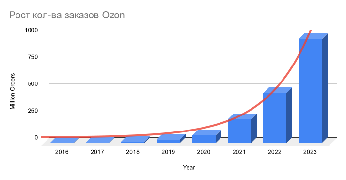
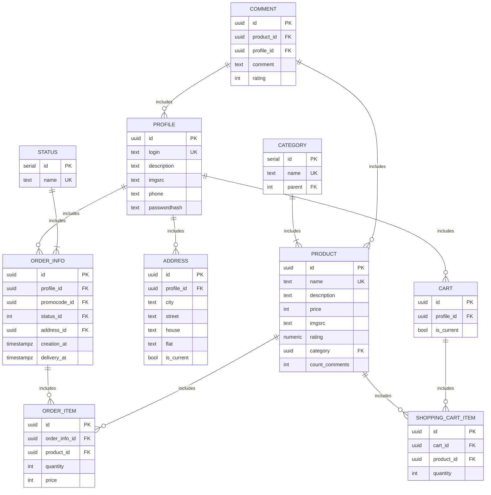

                                          Highload Ozon

---

Содержание

#### 1. [Тема, целевая аудитория](#1)

#### 2. [Расчет нагрузки](#2)

#### 3. [Глобальная балансировка нагрузки](#3)
  
#### 4. [Локальная балансировка нагрузки](#4)
  
#### 5. [Логическая схема БД](#5)

#### 6. [Физическая схема БД](#6)

#### 7. [Технологии](#7)

  
* * #### [Источники](#sources)

---

1. Тема, аудитория, функционал

<h2>1. Тема, аудитория, функционал </h2>

### Тема
__Ozon__ — выход крупнейшего E-commerce России на рынок КНР.  
### Целевая аудитория  [[1](#sources)]
- Рынок КНР.
- Возрастная категория: 18-45 лет; 40% женщин, 60% мужчин.
- Уникальных пользователей:
	-  в месяц 70 млн. (MAU)
	-  в день 15 млн. (DAU)

### MVP
> - Каталог;
> - Поиск товаров в желаемой категории.

> - Корзина (просмотр, изменение);
> - Оформления заказа.

> - Cтраница товара;
> - Отзывы и рейтинг.

> - Список заказов;
> - Обновление статуса заказа в личном кабинете, трекинг заказа от службы доставки (получение новых данных о статусе);
> - Рассылка Push-уведомлений об изменении статуса заказа.

### Логистика и фулфилмент
В рамках __MVP__ ограничимся двумя видами фулфилмента __FBS__ и __rFBS__, откажемся от __FBO__, т.е. от хранения товара на собственных складах.

  __FBS__ (_Fulfillment by Seller_) — 
cеллер хранит товар на собственном складе,
самомостоятельно собирает заказ и передаёте заказ в службу доставки.

__rFBS__ (_real FBS_) — схема работы, при которой продавец сам отвечает за хранение и доставку товара.
 

Схема __FBS__ от Ozon  [[11](#sources)]

---

2. Расчет нагрузки

<h2>2. Расчет нагрузки</h2>

### 2.1. Продуктовые метрики

***За ориентир взят Ozon в 2021г.***

*  `70 млн.` — **MAU** (посетителей в месяц) (80% от [[1](#sources)])
* `15 млн.` — **DAU** (посетителей в день) (20% от MAU)
* `90 тыс.` — активных продавцов [[19](#sources)]
*  `82 млн.`—  **SKU** (единиц товара) [[19](#sources)] [[20](#sources)]

* `108%` — **YoY** (годовые изменения) количества заказов `223.3 млн. - 2021г`; `465.4 млн. - 2022г` [[17](#sources)]
* `38%` — **YoY** (годовые изменения) количества покупателей, которые разместили хотя бы один заказ в течение года `25.6 млн. - 2021г`; `35.2 млн. - 2022г` [[17](#sources)]

* `36` карточек товара помещается на одной странице выдачи Озон

### Конверсии
* `3%` — **CR** (конверсия в покупку) $`CR = \frac{25.6}{12\cdot MAU} \cdot  100\% =3\%`$ — что соответсвует средней конверсии по миру  среди маркетплейсов [[18](#sources)] Откуда **MAU** равняется 70 млн.
* `70%` — **CAR** (уровень брошенных корзин),  30% процентов посетителей интернет магазинов, положивших товар в корзину, рано или поздно завершают процесс покупки, остальные 70% - брошенные корзины. [[15](#sources)]
* `2%` — конверсия в корзину из карточки товара — отношение количества добавлений товара в корзину к количеству уникальных посетителей, которые просмотрели карточку товара. Эта величина колеблится в диапазоне от 1% до 15%, используем нижнюю границу — 2%.
* `32%` —  конверсии от покупки к оставленному отзыву. Вероятность того, что клиенты оставят отзыв после позитивного опыта взаимодействия с брендом - 28%. После негативного - 34%. [[22](#sources)] 
*  `7%` — показатель отказа (Bounce Rate), следовательно конверсия из авторизации в поиск 93%, т.е 7% от DAU при заходе на главную страницу покидают сайт, ничего не сделав, а 93% хотя бы пользуются поиском или каталогом.[[16](#sources)]

---
### Операционные показатели по годам [[21](#sources)]

***Формула для рассёта месячной аудитории: $` MAU = \frac{П/г}{12 \cdot CR}`$***

| Год  | П/г  | *П/г-YoY* | MAU | З/г   | *З/г-YoY* | Чз/г    |*Чз/г-YoY* | SKU |
| ---- | ---- | ----      | --- | ----- | -----     |---      |--         | --  |
| 2023 | 46.1 | +31%      | 128 | 966   | +107%     | 21      | +59%      | 250 | 
| 2022 | 35,2 | +37%      | 98  | 465.4 | +108%     | 13.2    | +52%      | 170 |
| **TOTAL**| —| —         | —   |**356.8** | —     | —       | —         | —   |
|`2021`| 25,6 | +86%      | 70  | 223.3 | +202%     | 8.7     | +61%      | 82  |
| 2020 | 13,8 | +75%      | 38  | 73.9  | +132%     | 5,4     | +33%      | 11  |
| 2019 | 7,9  | —         | 22  | 31.8  | +105%     | 4,0     | —         | —   |
| 2018 | —    | —         | —   | 15.5  | +80%      | —       | —         | —   |
| 2017 | —    | —         | —   | 8.6   | +50%      | —       | —         | —   |
| 2016 | —    | —         | —   | 5.7   | —         | —       | —         | —   |

 Расшифровка столбцов
* П/г [млн.] —  количество активных (уникальных) покупателей, разместивших заказ хотя бы раз в течение года.
* З/г [млн.] —  количество заказов от всех покупателей за год. [[25](#sources)] 
* Чз/г  — среднее количество заказов, сделанных покупателем в течение года.
* SKU [млн.] — ассортимент единиц товара на площадке.
---

### Технические метрики от Ozon

- `612k` — заказов в сутки  $`\frac{223.3 \cdot 10^6}{365} = 611780`$  [[1](#sources)]
- `50k` — заказов в минуту в дни распродаж (80% от [[1](#sources)])
- `6kRPS` — нагрузка на поиск и каталог (пропорционально росту MAU возьмём 55% от RPS в 2023г[[13](#sources)]) 
- `27.5kRPS` — в пике нагрузка на поиск и каталог (55% от [[13](#sources)])

***MAU*** за 2023 = 128 млн. $`\frac{70}{128} \cdot 100 \%=55\%`$. Следовательно RPS в 2021: $`11kRPS \cdot 0.55 = 6kRPS`$, пиковый: $`50kRPS \cdot 0.55 = 27.5kRPS`$

---

### Cтатусы заказа [[23](#sources)]

#### Статусы до отправки
| *Создан*| *Ожидает оплаты*|  *В сборке*|
|-|-|-|

#### Статусы после отправки:
| *Передаётся в доставку*| *В пути*| *У курьера* | *Ожидает*| *Доставлено* |*Получен* |*Отменено* |
|-|-|-|-|-|-|-|

Наиболее вероятная цепочка статусов: *'В сборке'* — *'Передаётся в доставку'* — *'В пути'*  — *'У курьера'* — *'Получен'*.
Итого в среднем заказ проходит через 5 статусов. Рассылка Push-уведомлений по двум статусам: *'В пути'* и *'У курьера'*/*'Ожидает'*.
 
---

### Среднее количество действий пользователя по типам в день

----

Открытых источников информации нет. Данные о *среднем количестве действий пользователя по типам в день* получены из сердних показателей конверсий по eCommerce [[14](#sources)] [[15](#sources)] [[16](#sources)].

---

| Действие | Расчёт | В среднем за день|
| ---- | ---- | ---- |
| Просмотр каталога и поиск | $`\frac{6kRPS\cdot 3600 \cdot 24}{93\% \cdot DAU} `$ | 37 |
| Заказ товара | $`\frac{611 780}{93\% \cdot  DAU}`$ | 0.04 |
| Добавление в корзину | $`\frac{0.04}{30\%}`$ | 0.13 |
| Просмотр отдельного товара | $`\frac{0.13}{2\%}`$| 6,5 |
| Отзывы и рейтинг | $`32\% \cdot 0.04`$ | 0.0128 | 
| Обновление статуса заказа   |  $`0.04 \cdot 5`$  | 0.2 |
| Просмотр списка заказов     |  $`70\% \cdot 0.2`$ | 0.14 |
| Рассылка Push-уведомлений | $`\frac{2}{5} \cdot 0.2`$ | 0.08 | 

---

Глубина просмотра (Page Depth)

---

### 2.2. Технические метрики

| Действие | Расчёт | В среднем за день|
| ---- | ---- | ---- |
| Просмотр каталога и поиск | — | 6k RPS |
| Заказ товара | $`\frac{223.6\ \cdot\ 10^{6}}{365\cdot24\cdot3600}`$ | 7 RPS |
| Добавление в корзину | $`\frac{0.13\cdot DAU\cdot0.93}{24\cdot3600}`$ | 21 RPS |
| Просмотр отдельного товара | $`\frac{6.5\cdot DAU\cdot0.93}{24\cdot3600}`$ | 1050 RPS |
| Отзывы и рейтинг | $`\frac{0.0128\cdot DAU\cdot0.93}{24\cdot3600}`$ | 2 RPS | 
| Обновление статуса заказа   |  $`\frac{0.2\cdot DAU\cdot0.93}{24\cdot3600}`$  | 32 RPS |
| Просмотр списка заказов     |  $`\frac{0.14\cdot DAU\cdot0.93}{24\cdot3600}`$ | 23 RPS |
| Рассылка Push-уведомлений | $`\frac{ 0.08\cdot DAU\cdot0.93}{24\cdot3600}`$ | 12 RPS | 

### Размер хранения в разбивке по типам данных:

#### Карточки товара
Ozon позволяет добавлять до 15 фотографий к карточке товара, размером не более 10 Мб.[[24](#sources)] Возьмём среднюю оценку 7 фотографий на товар и средний размер фотографии 200 КБ, тогда общий объем фотографий 1.5 Мб.

Описание товара может содержать текст и изображения. Среднее описание товара составляет 500 слов, что составляет около 1 Мб байт, и 2 изображения - 0.5 Мб. 

Конверсия от покупки к оставленному отзыву 32%. За 2016г-2021г было сделано 356.8 млн. заказов $\Rightarrow$ 71.1 млн. отзывов.
 
 

---

 Объем изображений в отзывах

Пусть 15% товаров имеют порядка 100 отзывов. И 1% отзывов из списка имеют [2, 7] фотографий. Тогда `250млн*0.15*(100*0.01*5) = 187.5млн` - изображений приходится на долю отзывов. Объём `187.5млн * 50 КБ = 8,73 ТБ`

$` \frac{25.6\cdot 10^6}{0.3\cdot 365} = 234\cdot 10^3 `$ - 234 тыс. пользователей хотя бы раз добавили в корзину товар  за все свои визиты в течение дня

1.3 * DAU * 0.93 = 18135k просмотров всех карточек товаров за день
18135

0.13 * DAU 0.93 = 1813 тыс. раз пользователи добавили в корзину товар за все свои визиты в течение дня

1813 / 234 = 8 раз в среднем пользователь добавляет товар в корзину в течение дня

Воронка конверсий eCommerce [[16](#sources)]

---

3. Глобальная балансировка нагрузки

<h2>3. Глобальная балансировка нагрузки</h2>

Плотность населения КНР

---

4. Локальная балансировка нагрузки

<h2>4. Локальная балансировка нагрузки</h2>

Возможные решения:
* *Weight round robin*
* *Consistent Hash*
* *Least Connected*
* *PeakEWMA*
#### Выберем *_PeakEWMA_*
Рассчитываем скользящее среднее
времени длительности запросов и,
исходя из этого, выбираем бэкенд, на
который вышлем нагрузку.
Данный алгоритм использует концепцию экспоненциально взвешенных скользящих средних для определения «пиковой» нагрузки серверов.
Присваивая веса недавним измерениям трафика, он точно фиксирует текущую нагрузку сервера и динамически корректирует свой выбор для входящих запросов.

Эксперимент с тремя алгоритмами: round robin, least loaded, and peak exponentially-weighted moving average (“peak EWMA”)

*PeakEWMA* показал наибольшее лучшии метрики при тестах в Ozon.

---

5. Логическая схема БД

<h2>5. Логическая схема БД</h2>

 

| Type          | Byte size |
| ------------- | --------- |
| SERIAL        | 4         |
| UUID          | 16        |
| INT           | 4         |
| NUMERIC(3, 2) | 8         |
| timestampz    | 8         |
| boolean       | 1         |

| Table              | Row size [byte]                   | Number of row | Total |
| ------------------ | --------------------------------- | ------------- | ----- |
| PROFILE            | 16 + 32 + 128 + 64 + 19 +64 = 323 |               |       |
| PRODUCT            |                                   |               |       |
| COMMENT            |                                   |               |       |
| ORDER_INFO         |                                   |               |       |
| STATUS             |                                   |               |       |
| ORDER_ITEM         |                                   |               |       |
| ADDRESS            |                                   |               |       |
| CATEGORY           |                                   |               |       |
| CART               |                                   |               |       |
| SHOPPING_CART_ITEM |                                   |               |       |

---

6. Физическая схема БД

<h2>6. Физическая схема БД</h2>

Используем СУБД PostgreSQL и патерн Database Per Service.
#### Преимущества PostgreSQL:
* Поддержка БД неограниченного размера
* Мощные и надёжные механизмы транзакций и репликации
* Легко масштабировать 

### Потоковая репликация

#### Плюсы
* Работает из коробки.
* Годами обкатанная технология.
* Низкое потребление ресурсов, так как никакой логики
 при репликации нет, изменения выполняются в том же
порядке, что и на мастере.
* Простота конфигурации, настроил и забыл, простое
побайтовое копирование через WAL.

#### Минусы
* Реплицируется весь кластер целиком.
* Реплицируются все операции, включая ошибки.
* Изменения применяются в один поток.
* Работа только в рамках одной мажорной версии.
* Слейвы только read only.

Структура кластера:
Один мастер, одна синхронная релпика и несколько асинхронных.

Патерн работы с данными.
Пишем в мастер.
Если супер актуальные данные и нужно минимизировать отставания, то читаем с синхронной реплики. В ином случае с асинхронных.
Избегаем обильного чтения с мастера и по возможности с синхронной реплики.
Базовое правило — в мастер пишем, читаем только из слейвов. Сихроная реплица выполняет функцию фейловера, она всегда находиться в другом ДЦ.

### Партиционирование

#### Решаемые проблемы:
Если много удаляем/апдейтим записи в базе, то vacuum может работать довольно долго.
Операции insert/update перестраивают индексы, идет перебалансировка деревьев.

Засчёт партиционирования кол-во индексов будет намного меньше, vacuum работает быстро на маленьких таблицах, следовательно все проблемы больших таблиц будут в N раз меньше.

Кол-во партиций делаем не более 100-200.

### Шардинг

Шардинг и решардинг сложная процедура, и использование готовых инструментов для шардинга в случае непридвиденных ситуаций приводит к разбирательству с чёрным ящиком. Сделаем свой инструмент.

#### Получение физического адреса данных и решардинг.
Shard Key, к примеру, user_id. Берём остаток от деления по модулю на 1024 от user_id и в зависимости от интервала куда попадает резуьтат 0..127, 128..255, 256..383 и т.д. выбираем физисеский адрес. Следоват решардинг делаем в рамках одного кластера и для этого делим предыдущие интервалы попалам, получаем: 0..63, 64..127, 128..191 и т.д.

В итоге, из опыта Ozon, для таблицы _CART_ чтобы держать 20K RPS можно сделать 32 шарда: 1 синхронная реплика и 2 асинхронных реплики, 100 партиций: cart_0, cart_1, cart_2...

#### Асинхронное межсервисное взаимодействие. Сбор измененных данных с паттерном Outbox на Apache Kafka. 

Этот паттерн решенает проблемыу потери событий.

__Коньюмер-группа: Cервис отслеживания заказа__

__Внутреннее устройство__

Используем Батчинг + сжатие

#### Сетевая файловая система (CEPH)

---

7. Технологии

<h2>7. Технологии</h2>

---

Источники

<h2>Источники</h2>

1. https://ozon.tech/
2. https://habr.com/ru/companies/ozontech/articles/667600/
3. https://www.youtube.com/watch?v=kIZ_4PNvkro
4. https://habr.com/ru/companies/ozontech/articles/749328/
5. https://linkerd.io/2016/03/16/beyond-round-robin-load-balancing-for-latency/
6. https://tenchat.ru/media/1400080-privet-bezuprechniy-balans-ili-kombinatsiya-peakewma-i-p2c-ot-twitter
7. https://super-video-tube.ru/video/7A7Cq9w0G9Y/ozon-tech-community-go-meetup/
8. https://speakerdeck.com/ozontech/dmitrii-loghovskii-kak-zastavit-vashu-bazu-dannykh-dierzhat-20k-rps-varianty-masshtabirovaniia-i-ikh-minusy
9. https://bigdataschool.ru/blog/transactional-outbox-pattern-on-neo4j-and-kafka.html
10. https://speakerdeck.com/ozontech/viktor-korieisha-camyie-rasprostraniennyie-oshibki-pri-rabotie-s-apache-kafka
11. https://seller-edu.ozon.ru/how-to-start/onboarding/step-4-choose-work-mode 
12. https://speakerdeck.com/ozontech/boris-kuzovatkin-put-posylki-kliuchievyie-tiekhnologhii-i-proiekty-v-loghistikie
13. https://speakerdeck.com/ozontech/van-khachatrian-osobiennosti-stiek-i-protsiessy-komandy-poisk-riekomiendatsii-rieklama
14. https://baymard.com/blog/ecommerce-checkout-usability-report-and-benchmark
15. https://baymard.com/lists/cart-abandonment-rate
16. https://vc.ru/marketing/684029-ecommerce-metriki-dlya-novichkov-chto-zameryat-v-internet-magazine
17. https://corp.ozon.ru/tpost/ykmxt937i1-ozon-obyavlyaet-rezultati-za-chetvertii
18. https://www.yaguara.co/average-e-commerce-conversion-rate/
19. https://corp.ozon.ru/tpost/nlexf0jrb1-ozon-predostavlyaet-obnovlennuyu-informa
20. https://russianblogs.com/article/24031270152/
21. https://ir.ozon.com/ru/
22. https://e-pepper.ru/news/kak-riteylery-motiviruyut-klientov-ostavlyat-otzyvy.html
23. https://docs.ozon.ru/common-mobile/order/status/?country=RU
24. https://seller-edu.ozon.ru/work-with-goods/trebovaniya-k-kartochkam-tovarov/media/foto-i-video-tovara
25. https://top100.datainsight.ru/

