                                          Highload Ozon


---

<h3 id="Content">Содержание</h3>

#### 1. [Тема, целевая аудитория](#1)
#### 2. [Расчет нагрузки](#2)
#### 3. [Глобальная балансировка нагрузки](#3)
#### 4. [Локальная балансировка нагрузки](#4)
#### 5. [Логическая схема БД](#5)
#### 6. [Физическая схема БД](#6)
#### 7. [Алгоритмы](#7)
#### 8. [Технологии](#8)
#### 9. [Схема проекта](#9)
#### 10. [Обеспечение надёжности](#10)
#### 11. [Список серверов](#11)
  
* * #### [Источники](#sources)


---

<h2 id="1">1. Тема, аудитория, функционал </h2>

### Тема

__Ozon__ — выход крупнейшего E-commerce России на рынок КНР (***IPO***). 
Соотношение числа активных продавцов, работающих в рамках направления «Ozon Глобал», к общему числу равняется $`\frac{59K}{400K}`$ [[26](#sources)] [[27](#sources)], из этого следует актуальность выбраного рынка с точки зрения бизнеса.

### Целевая аудитория  [[1](#sources)]
- Рынок КНР.
- Возрастная категория: 18-45 лет; 40% женщин, 60% мужчин.
- Уникальных пользователей:
	-  в месяц 70 млн. (MAU)
	-  в день 15 млн. (DAU)


### MVP
> - Каталог;
> - Поиск товаров в желаемой категории.

> - Корзина (просмотр, изменение);
> - Оформления заказа.

> - Cтраница товара;
> - Отзывы и рейтинг.

> - Список заказов;
> - Обновление статуса заказа в личном кабинете, трекинг заказа от службы доставки (получение новых данных о статусе);
> - Рассылка Push-уведомлений об изменении статуса заказа.

### Логистика и фулфилмент
В рамках __MVP__ ограничимся двумя видами фулфилмента __FBS__ и __rFBS__, откажемся от __FBO__, т.е. от хранения товара на собственных складах.

  __FBS__ (_Fulfillment by Seller_) — 
cеллер хранит товар на собственном складе,
самомостоятельно собирает заказ и передаёте заказ в службу доставки.

__rFBS__ (_real FBS_) — схема работы, при которой продавец сам отвечает за хранение и доставку товара.
 


Схема __FBS__ от Ozon  [[11](#sources)]

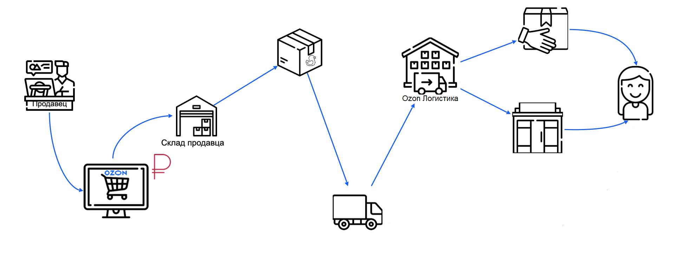


---

<h2 id="2">2. Расчет нагрузки</h2>

### 2.1. Продуктовые метрики

***За ориентир взят Ozon в 2021г.***

*  `70 млн.` — **MAU** (см. операционные показатели) (80% от [[1](#sources)])
* `15 млн.` — **DAU** (20% от MAU)
* `90 тыс.` — активных продавцов [[19](#sources)]
*  `82 млн.`—  **SKU** — ассортимент единиц товара [[19](#sources)] [[20](#sources)]

* `108%` — **YoY** — годовые изменения количества заказов `223.3 млн. - 2021г`; `465.4 млн. - 2022г` [[17](#sources)]
* `38%` — **YoY** — годовые изменения количества покупателей, которые разместили хотя бы один заказ в течение года `25.6 млн. - 2021г`; `35.2 млн. - 2022г` [[17](#sources)]

* `36` карточек товара помещается на одной странице выдачи Озон

### Конверсии
* `3%` — **CR** (конверсия в покупку) $`CR = \frac{25.6}{12\cdot MAU} \cdot  100\% =3\%`$ — что соответсвует средней конверсии по миру  среди маркетплейсов [[18](#sources)] Откуда **MAU** равняется 70 млн.
* `70%` — **CAR** (уровень брошенных корзин),  30% процентов посетителей интернет магазинов, положивших товар в корзину, рано или поздно завершают процесс покупки, остальные 70% - брошенные корзины. [[15](#sources)]
* `2%` — конверсия в корзину из карточки товара — отношение количества добавлений товара в корзину к количеству уникальных посетителей, которые просмотрели карточку товара. Эта величина колеблится в диапазоне от 1% до 15%, используем нижнюю границу — 2%.
* `51%` —  конверсии от покупки к оставленному отзыву. `15%` пользователей не пишут развернутые комментарии, но ставят оценку товару. `6%` от тех кто оставил отзыв прикрепят фотографию [[29](#sources)] 
*  `7%` — показатель отказа (**Bounce Rate**), следовательно конверсия из авторизации в наиболее вероятные действия, просмотр каталога и поиск, 93%, т.е 7% от DAU при заходе на главную страницу покидают сайт, ничего не сделав, а 93% хотя бы пользуются поиском или каталогом.[[16](#sources)]


---
### Операционные показатели по годам [[21](#sources)]

***Формула для расчёта месячной аудитории: $` MAU = \frac{П/г}{12 \cdot CR}`$***


| Год       | П/г  | *П/г-YoY* | MAU | З/г       | *З/г-YoY* | Чз/г | *Чз/г-YoY* | SKU  | *SKU-YoY* |
| --------- | ---- | --------- | --- | --------- | --------- | ---- | ---------- | ---- | --------- |
| 2023      | 46.1 | +31%      | 128 | 966       | +107%     | 21   | +59%       | 250  | +47%      |
| 2022      | 35,2 | +37%      | 98  | 465.4     | +108%     | 13.2 | +52%       | 170  | +107%     |
| **TOTAL** | —    | —         | —   | **356.8** | —         | —    | —          | —    | —         |
| `2021`    | 25,6 | +86%      | 70  | 223.3     | +202%     | 8.7  | +61%       | 82   | +645%     |
| 2020      | 13,8 | +75%      | 38  | 73.9      | +132%     | 5,4  | +33%       | 11   | —         |
| 2019      | 7,9  | —         | 22  | 31.8      | +105%     | 4,0  | —          | —    | —         |
| 2018      | —    | —         | —   | 15.5      | +80%      | —    | —          | —    | —         |
| 2017      | —    | —         | —   | 8.6       | +50%      | —    | —          | —    | —         |
| 2016      | —    | —         | —   | 5.7       | —         | —    | —          | —    | —         |


 Расшифровка столбцов:
* **П/г** *[млн.]* —  количество активных (уникальных) покупателей, разместивших заказ хотя бы раз в течение года.
* **З/г** *[млн.]* —  количество заказов от всех покупателей за год. [[25](#sources)] 
* **Чз/г**  — среднее количество заказов, сделанных покупателем в течение года.
* **SKU** *[млн.]* — ассортимент единиц товара на площадке.


---

### Cтатусы заказа [[23](#sources)]

#### Статусы до отправки
| *Создан*| *Ожидает оплаты*|  *В сборке*|
|-|-|-|

#### Статусы после отправки:
| *Передаётся в доставку*| *В пути*| *У курьера* | *Ожидает*| *Доставлено* |*Получен* |*Отменено* |
|-|-|-|-|-|-|-|


Наиболее вероятная цепочка статусов: *'В сборке'* — *'Передаётся в доставку'* — *'В пути'*  — *'У курьера'* — *'Получен'*.
Итого в среднем заказ проходит через 5 статусов. Рассылка Push-уведомлений по двум статусам: *'В пути'* и *'У курьера'*/*'Ожидает'*.
 
---

### Технические и пиковые метрики от Ozon

Нагрузка на поиск и каталог в 2023г 11k RPS, пиковая 50k RPS [[13](#sources)].
Пропорционально росту **MAU** посчитаем RPS в 2021г, взяв некий процент от RPS в 2023г. Т.е. **MAU** за 2023 = 128 млн. $`\frac{70}{128} \cdot 100 \%=55\%`$. Следовательно RPS в 2021: $`11kRPS \cdot 0.55 = 6kRPS`$, пиковый: $`50kRPS \cdot 0.55 = 27.5kRPS`$
В итоге к 2023г нагрузка выростет пропорционально **MAU** относительно 2021 в `1.83`.

В период распродажи пиковый RPS на сервис поиска и каталога 27.5k, в то время как средний RPS 6k. В момент распродажи нагрузка возрастает в 4.5, возьмём пиковый множитель `5`.

`x9,15` — множитель от средней нагрузки в 2021г к пиковой в 2023 $5 \cdot 1.83 = 9.15$ 

- `612k` — заказов в сутки  $`\frac{З/г \cdot 10^6}{365} = 611780`$  [[1](#sources)]
- `60k` — заказов в минуту в дни распродаж [[1](#sources)]
- `6kRPS` — нагрузка на поиск и каталог
- `27.5kRPS` — в пике нагрузка на поиск и каталог (55% от [[13](#sources)])


---

### Среднее количество действий пользователя по типам в день, 2021г

----

Открытых источников информации нет. Данные о *среднем количестве действий пользователя по типам в день* получены из средних показателей конверсий по eCommerce [[14](#sources)] [[15](#sources)] [[16](#sources)], отталкиваясь от технических метрик Ozon  [[1](#sources)] [[13](#sources)].


| Действие                   | Расчёт                                               | В среднем за день |
| -------------------------- | ---------------------------------------------------- | ----------------- |
| Просмотр каталога и поиск  | $`\frac{6kRPS\cdot 3600 \cdot 24}{93\% \cdot DAU} `$ | 37                |
| Заказ товара               | $`\frac{611 780}{93\% \cdot  DAU}`$                  | 0.04              |
| Добавление в корзину       | $`\frac{0.04}{30\%}`$                                | 0.13              |
| Просмотр отдельного товара | $`\frac{0.13}{2\%}`$                                 | 6,5               |
| Отзывы и рейтинг           | $`51\% \cdot 0.04`$                                  | 0.02              |
| Обновление статуса заказа  | $`0.04 \cdot 5`$                                     | 0.2               |
| Просмотр списка заказов    | $`70\% \cdot 0.2`$                                   | 0.14              |
| Рассылка Push-уведомлений  | $`\frac{2}{5} \cdot 0.2`$                            | 0.08              |


---

### 2.2. Технические метрики, 2021г

### RPS
| Действие                   | Расчёт                                               | Средняя нагрузка, 2021г | Пиковая нагрузка, 2023г `x9,15` |
| -------------------------- | ---------------------------------------------------- | ----------------------- | ------------------------------- |
| Просмотр каталога и поиск  | [[13](#sources)]                                     | 6k RPS                  | 54.9k RPS                       |
| Заказ товара               | $`\frac{223.6\ \cdot\ 10^{6}}{365\cdot24\cdot3600}`$ | 7 RPS                   | 64 RPS                          |
| Добавление в корзину       | $`\frac{0.13\cdot DAU\cdot0.93}{24\cdot3600}`$       | 21 RPS                  | 192 RPS                         |
| Просмотр отдельного товара | $`\frac{6.5\cdot DAU\cdot0.93}{24\cdot3600}`$        | 1050 RPS                | 9 607 RPS                       |
| Отзывы и рейтинг           | $`\frac{0.02\cdot DAU\cdot0.93}{24\cdot3600}`$       | 4 RPS                   | 37 RPS                          |
| Обновление статуса заказа  | $`\frac{0.2\cdot DAU\cdot0.93}{24\cdot3600}`$        | 32 RPS                  | 293 RPS                         |
| Просмотр списка заказов    | $`\frac{0.14\cdot DAU\cdot0.93}{24\cdot3600}`$       | 23 RPS                  | 210 RPS                         |
| Рассылка Push-уведомлений  | $`\frac{ 0.08\cdot DAU\cdot0.93}{24\cdot3600}`$      | 12 RPS                  | 110 RPS                         |
| ***TOTAL***                | —                                                    | 7 150 RPS               | 65 500 RPS                      |

---
### Размер хранения в разбивке по типам данных

#### Карточка товара без учёта отзывов
Ozon позволяет добавлять до 15 фотографий к карточке товара, размером не более 10 Мб.[[24](#sources)] Возьмём среднюю оценку 7 фотографий на товар и средний размер фотографии 200 КБ, тогда общий объем фотографий `1,37 Мб`.

Описание товара может содержать текст и изображения. Среднее описание товара составляет 500 слов, что составляет около 1 Кб, с учётом дополнительных технических сведений 2 Кб. В среднем содержит 2 изображения ~ 400 Кб. В сумме ~`0.4 Мб`.

Итого ***`1.77 Мб`  на краточку***. $`82\cdot 10^6 \cdot 1.77 = 145 140 000  Mb \Rightarrow`$  `138,42 Тб`

#### Отзывы и рейтинг
Конверсия от покупки к оставленному отзыву 51%. Из таблицы операционных показателей видно, что за 2016г-2021г было сделано 356.8 млн. заказов $\Rightarrow$ 182 млн. отзывов. 
15% имееют только рейтинг $\Rightarrow$ `53.5 млн`, а остальные `128.5 млн` - полноценный отзыв. 6% имеют фотографии  $\Rightarrow$ `21.4 млн.`

Выделим на текст для отзыва в среднем 256 байт 0.25 Кб. $`128.5 \cdot 10^6 \cdot 0.25 = 32 125 000Kb \Rightarrow`$ 0.03 Тб. 1 байт на рейтинг: 53.5 млн. байт = 0,000049 Тб.

Заложим на медиаконтент в отзыве 0.5 Мб $\Rightarrow$
$`21.4 \cdot 10^6 \cdot 0.5 = 10 700 000 Mb \Rightarrow`$ `10,2 Тб`

---
### Суммарный размера хранения и его рост
Итого в сумме `150 Тб` хранилища требуется на момент конца 2021г.

***YoY*** в 2022г для ассортимента SKU равняется +107%  $\Rightarrow$  Тогда за 2022г хранилище карточек товара вырастет ещё на +148.5 Тб и составит 287 Тб. За 2023г равняется +47%  $\Rightarrow$ рост +134.8 Тб и составит `422 Тб`.

***YoY*** в 2022г количество заказов от всех покупателей за год равняется +108%   $\Rightarrow$ хранилище отзывов вырастет на +11 Тб и составит 21.2 Тб. За 2023г +107%   $\Rightarrow$ хранилище отзывов вырастет на +22.7 Тб и составит `45 Тб`.

Итого **суммарный рост** за 2022г равен `160 Тб`. За 2023г равен `157,5 Тб`.


---
### Сетевой трафик

`100Гбит/c` — трафик в пике на поиск и каталог на момент 2022г.(пропорционально росту MAU возьмём 70% от трафика в 2022г [[30](#sources)]) Т.е. отношение ***MAU***   $`\frac{70}{98} \cdot 100 \%=70\%`$. Следовательно пиковый трафик в 2021 $`100Гбит/c \cdot 0.70 = 70Гбит/c`$,
средний: $`\frac{70}{5} = 14Гбит/c`$


По итогу анализа трафика в панели инструментов браузера:
- Запрос на добавление в корзину в среднем имеет размер 70Кб.
- Размер перенесённого трафика при просмотре страницы товара в два раза больше размера трафика при просмотре каталога и поиске, что соответствует полученным данным 0.6Мб и 0.3Мб.

#### Исходящий трафик

| Тип запроса               | Размер 1 запроса                                                              | Тбит/сутки, 2021г.                          | Гбит/с, 2021г | *Пиковый* Гбит/c, 2021г | *Пиковый* Гбит/c, 2023г |
| ------------------------- | ----------------------------------------------------------------------------- | ------------------------------------------- | ------------- | ----------------------- | ----------------------- |
| Страница товара           | 0.6 Мб                                                                        | $`0.6\cdot 6.5 \cdot 0.93\cdot DAU = 415`$  | 4.9           | 24.5                    | 44.8                    |
| Просмотр каталога и поиск | $`\frac{1 238 630 400 Мбит/сутки}{37\cdot 0.93\cdot DAU}=`$ 2.4 Мбит = 0.3 Mб | $1181.2$                                    | 14            | 70                      | 128.1                   |
| Добавление в корзину      | 70Кб                                                                          | $`70\cdot 0.13 \cdot 0.93\cdot DAU = 0.95`$ | 0.011         | 0.055                   | 0.1                     |
| **TOTAL**                 |                                                                               | 1 597                                       | 19            | 94.5                    | 173                     |


---

<h2 id="3">3. Глобальная балансировка нагрузки</h2>


### Особенности CDN в КНР [[33](#sources)]

* Интернет в Китае полностью отличается от глобального интернета, похож на остров с ограниченными точками входа и выхода. Действует «*Великий Китайский файрвол*», который обладает способностью отслеживать, подвергать цензуре и блокировать ПО или информацию, которые, по его мнению, противоречат его национальным интересам.

* Нельзя запустить сайт электронной коммерции без лицензии интернет-контент-провайдера (**ICP**). Лицензия **ICP** - это юридическое разрешение, которое позволяет любой компании, местной или международной, размещать веб-сайт на сервере в материковом Китае.  

* На территории КНР действует три Tier-1 оператора:
[*China Telecom*](https://ru.wikipedia.org/wiki/China_Telecom), [*China Mobile*](https://ru.wikipedia.org/wiki/China_Mobile), [*China Unicom*](https://ru.wikipedia.org/wiki/China_Unicom). Эти провайдеры не общаются друг с другом напрямую из-за отсутствия одноранговых соединений, они намеренно ограничивают пропускную способность своих соединений из-за конкуренции.

* В Китае есть три точки входа и выхода подводного оптического волокна, которые влияют на общий интернет-трафик. Эти пункты расположены в Шаньтоу, Шанхае и Циндао.

* Основная единица административно-территориального деления Китая называется провинцией.

Для глобальной балансировки **BGP Anycast** необходимо зарегистрировать новую автономную систему (**AS**) и получить коммерческую лицензию **ICP**.

Собственные DNS-серверы Anycast должны вещать индивидуально внутри каждого оператора, а не от одного оператора к другому. Необходимо избежать взаимного магистрального соединения между различными интернет-провайдерами. Возмем за основную **AS** - *China Telecom Backbone*, т.к. этот оператор наиболее распространён в южном Китае, где находится бОльшая часть населения. От остальных двух Tier-1 операторов нужно настроить BGP маршруты как можно приоритетней в нашу **AS**. Тем самым решится проблема с низкой пропускной способностью, вызванной конкуренцией между операторами.

Самый большой теоретический **RTT** находится между Урумчи и Гаунчжоу. Значение не привышает 100 ms, было измеренно с помощью иструмента самого Tier-1 оператора: *China Telecom - LOOKING GLASS* [[35](#sources)]
`round-trip min/avg/max = 84.607/84.651/84.759 ms` 

Исходя из карты внутренних магистральных сетей Китая и плотности населения расположим 4 **ЦОД** в слеюдующих городах, см. в таблицу ниже. Утвердим за каждым  **ЦОД** субъект страны так, чтобы на каждый приходилась, примерно, одинакая доля нагрузки. [[35](#sources)] В случае потери одного **ЦОД** нагрузка на соседние **ЦОД** не превысит 10k RPS. Т.е. нагрузка в непредвиденной ситуации на любой **ЦОД** не привешает `~30k RPS`. 

В итоге, клиентский трафик заводится в 4 **ЦОД** через  **BGP Anycast**. Далее посредством *Equal-cost multi-path routing* (**ECMP**) попадает на несколько LoadBalancer c защитой от DNS- и DoS-атак. **ECMP** роутинг 
может использоваться в сочетании с **BGP**, использования этой стратегии маршрутизации, при которой пакеты пересылаются по нескольким «лучшим путям», увеличивает пропускную способность сети.

|Провинция|Всего, человек|в 2020, %|ЦОД|
| --- | --- | --- | --- |
|Пекин|21893095|1,46|CD-1|
|Тяньцзинь|13866009|0,97|CD-1|
|Хэбэй|74610235|5,36|CD-1|
|Шаньси|34915616|2,67|CD-1|
|Внутр. Монголия|24049155|1,84|CD-1|
|Ляонин|42591407|3,27|CD-1|
|Гирин|24073453|2,05|CD-1|
|Хэйлунцзян|31850088|2,86|CD-1|
|Шанхай|24870895|1,72|CD-2|
|Цзянсу|84748016|5,87|CD-2|
|Чжэцзян|64567588|4,06|CD-2|
|Аньхой|61027171|4,44|CD-2|
|Фуцзянь|41540086|2,75|CD-2|
|Цзянси|45188635|3,33|CD-2|
|Шаньдун|101527453|7,15|CD-1|
|Хэнань|99365519|7,02|CD-3|
|Хубэй|57752557|4,27|CD-4|
|Хунань|66444864|4,9|CD-2|
|Гуандун|126012510|7,79|CD-3|
|Гуаньси|50126804|3,44|CD-3|
|Хайнань|10081232|0,65|CD-3|
|Чунцин|32054159|2,15|CD-4|
|Сычуань|83674866|6|CD-4|
|Гуйчжоу|38562148|2,59|CD-3|
|Юньнань|47209277|3,43|CD-4|
|Тибет|3648100|0,22|CD-4|
|Шэньси|39528999|2,79|CD-4|
|Ганьсу|25019831|1,91|CD-4|
|Цинхай|5923957|0,42|CD-4|
|Нинся|7202654|0,47|CD-4|
|Синьцзян|25852345|1,63|CD-4|
|Гонконг|7474200|—|CD-3|
|Макао|683218|—|CD-3|
|Тайвань|23561236|—|CD-3|


| Город, провинция                             | **№ ЦОД** | Доля населения | Пиковая нагрузка, 2023г | Охват населения |
| -------------------------------------------- | --------- | -------------- | ----------------------- | --------------- |
| *Пекин* (*Beiging*)                          | **DC-1**  | 25.6%          | 16 768 RPS              | <br>369'376'511 |
| *Шанхай* (*Shanghai*)                        | **DC-2**  | 26.9%          | 17 619 RPS              | <br>388'387'255 |
| *Гуанчжоу, Гуандун* (*Guangzhou, Guangdong*) | **DC-3**  | 24.7%          | 16 178R PS              | <br>355'866'867 |
| *Сиань, Шэньси* (*Xi'an, Shaanxi*)           | **DC-4**  | 22.8%          | 14 934 RPS              | <br>327'866'745 |

```topojson
{
  "type": "FeatureCollection",
  "features": [
    {
      "type": "Feature",
      "properties": {},
      "geometry": {
        "coordinates": [
          121.46751904896115,
          31.230752631345794
        ],
        "type": "Point"
      }
    },
    {
      "type": "Feature",
      "properties": {},
      "geometry": {
        "coordinates": [
          113.25935182000518,
          23.130321873002856
        ],
        "type": "Point"
      }
    },
    {
      "type": "Feature",
      "properties": {},
      "geometry": {
        "coordinates": [
          116.42355449358502,
          39.901959762589314
        ],
        "type": "Point"
      }
    },
    {
      "type": "Feature",
      "properties": {},
      "geometry": {
        "coordinates": [
          [
            87.61421681343529,
            43.83304144627465
          ],
          [
            103.83810774044815,
            36.066566282805766
          ],
          [
            108.90219628792397,
            34.27217060238723
          ],
          [
            114.29675517828841,
            30.584575881594322
          ],
          [
            115.02860547935467,
            30.19151287863273
          ],
          [
            115.9488438732886,
            29.65583466262948
          ],
          [
            115.86222814415865,
            28.700099346439163
          ],
          [
            113.26880729482582,
            23.116239773516625
          ]
        ],
        "type": "LineString"
      }
    },
    {
      "type": "Feature",
      "properties": {},
      "geometry": {
        "coordinates": [
          108.93482428457304,
          34.308277327107945
        ],
        "type": "Point"
      }
    }
  ]
}
```


#### Плотность населения и карта магистральных сетей *China Telecom Backbone* (серые линии). [[31](#sources)] [[32](#sources)] 
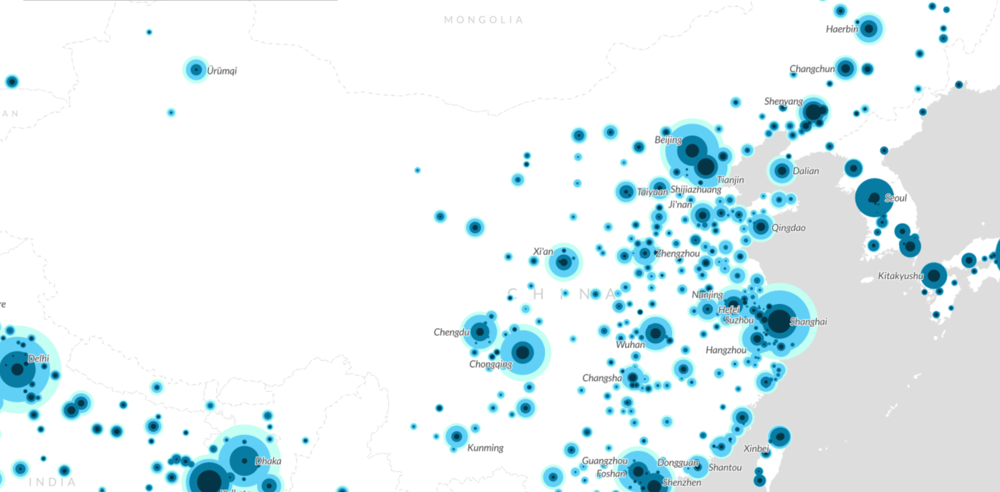
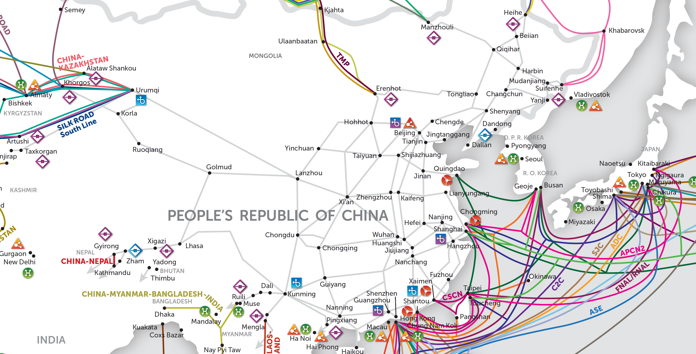

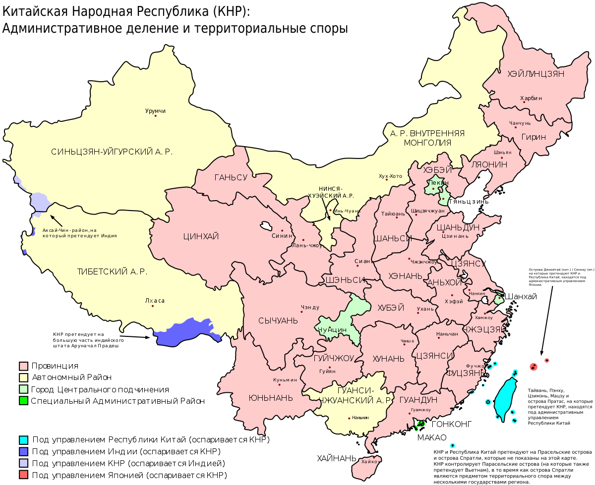

---

<h2 id="4">4. Локальная балансировка нагрузки</h2>

### Cервис разрешения доменных имен (DNS), Service Discovery


Пройдя глобальную балансировку, трафик посредством стратегии **ECMP** [[35](#sources)] [[37](#sources)] — многопутевой маршрутизации с равной стоимостью — попадает на несколько LoadBalancer. **ECMP** потенциально предлагает существенное увеличение пропускной способности за счет балансировки нагрузки по нескольким каналам. А **BGP**, в свою очередь, поддерживает **ECMP** роутинг. Таким образом точками входа клиентского трафика являеются машины с LoadBalancer, которые имеют единый **Virtual IP**. После них DNS-запрос от LoadBalancer направляется на пул локальных real-серверов, заранее прописанный в конфиге Caching DNS сервер (Resolver, рекурсивный преобразователь). Resolver сервер получает информацию от авторитетного (Authoritative) сервера и кеширут её локально с заданным **TTL**. [Политика выбора](https://dnsdist.org/guides/serverselection.html) real-сервера для поступившего запроса — Round-Robin DNS.

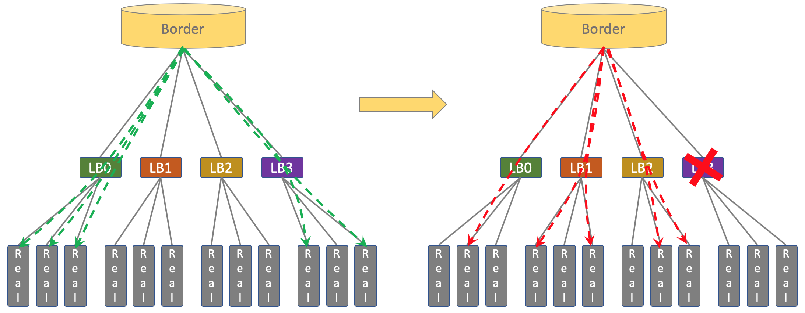


#### Failover
В случае проблем на одной из LoadBalancer **BGP**-анонс его **Virtual IP** прекращается, таблицы маршрутизации перестраиваются, клиенты идут на оставшиеся балансировщики. 
В случае недоступности Resolver и Authoritative DNS сервера, запросы идут Resolver и Authoritative DNS сервера находящийся в одном из соседних **ЦОД**.

#### Технологии [[37](#sources)]

В качестве LoadBalancer выберем L7 Dnsdist по следующим причинам: есть поддержка Resolver и Authoritative, L7 позволяет интегрировать дополнительную логику, защита от DNS- и DoS-атак, умеет лимитировать клиентов по DNS запросу и по IP.

У L4 балансеров по типу Haproxy есть недостатки, которые заключаются в том, что теряется source IP клиента. А работающие на уровне ядра (Kernelspace) L4 балансеры сложны в конфигурации.

<video loop="true" autoplay="autoplay" muted="" height="200">
  <source src="images/DNS-DIST.mp4" type="video/mp4">
</video>

Т.к. Dnsdist является продуктом PowerDNS, выберем решения от той же компании. Resolver сервер — PowerDNS Recursor, Authoritative — PowerDNS Auth. DNS записи ресурсов будем хранить в Generic Postgresql Backend, эта DB позволяет кешировать и обновалять зоны. Редактировать DNS записи будем через PowerDNS-Admin. 


### API Gateway
Далее после real-DNS-серверов трафки направляется в API-шлюз.
API-шлюз выступает как единая точка входа в ЦОД, отвечает за вертикальный(*north-south*) трафик. 
Выполняет следующие задачи:
* Абстрагирует сложности микросервисов и предлагает клиентам единообразный интерфейс для взаимодействия, GRPC Routing.
* Терминирует клиенский TLS, с внутренними сервисами общаться через mutual TLS.
* Обрабатывает аутентификацию и передаёт сервисам информацию о токенах, например, проверяет действительный ли JWT, прежде чем направить запрос во внутреннюю службу, распределяет нагрузку на конечную внутреннюю службу.
* Регулирует входящий и исходящий трафик, ставит глобальный и локальные Rate Limit,  устанавливает политику ретраев, осуществляет трассировка запросов, отдаёт Gateway API Metrics в Prometheus, observability в ControlPlane.

Возможные варианты реализации:[[42](#sources)]
* **Emissary-ingress** – это API-шлюз с открытым исходным кодом, разработанный для Kubernetes. Этот проект CNCF появился в 2017 году.
* **NGINX** —  это API-шлюз, который фактически предшествует Kubernetes и послужил основой для одного из первых контроллеров входящего трафика Kubernetes, называемого ingress-nginx. **NGINX** старее следующего конкурента  —  **Envoy Gateway**
* **Envoy Gateway** — это совершенно новый ingress controller. Это часть проекта CNCF Envoy-proxy, который является ядром двух отдельных CNCF API gateways (Emissary и Contour). В 2021 году разработчики из Emissary, Contour и Envoy собрались вместе и решили, что всем заинтересованным сторонам было бы лучше объединить свои усилия в единой расширяемой системе Envoy Gateway, которая будет выпущена в конце 2022 года.

Многие варианты API-шлюзов подходят под нашу архитектуру, выберем **Envoy Gateway** как самый передовой из них.


### Service Mesh

Исходишь трафик от API Gateway попадает в сервисную сеть, где принимается прокси-сайдкаром в целевом поде.

Service Mesh обеспечиваeт ряд преимуществ:
* Security: Поддержка автоматического шифрования — mutual TLS.
* Continuous Delivery: Доступность сложных шаблонов трафика, например, канареечный деплой, A / B-тестирования.
* Observability: tracing трафика.

Есть два наиболее популярных подхода реализации инфраструктурного слоя сервисной сетки:
 * ***Envoy + Istio*** [[40](#sources)]
 * ***Linkerd*** [[41](#sources)]


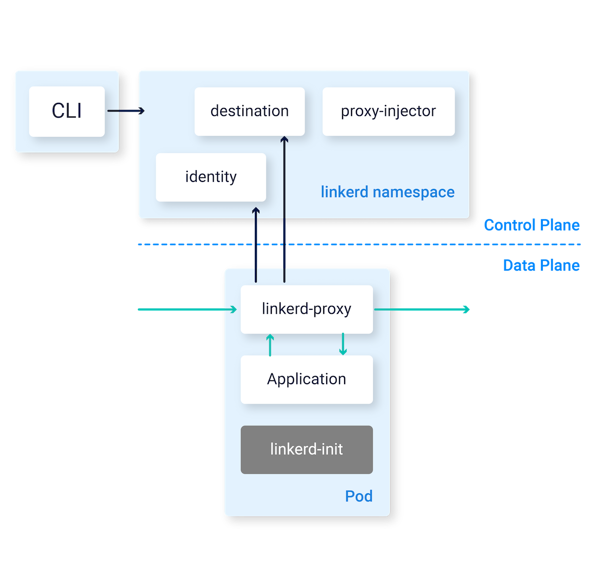
<br><br><br><br><br><br><br><br><br><br><br><br><br><br><br>

#### Различия и выбор между Istio и Linkerd

* Сайдкар контейнером у Istio служит Envoy, которые не поддерживает *PeakEWMA*.
*  Istio имеет обширным набором функций, что делает его более гибким, но и более сложным в настройке и управлении. Linkerd ориентирован на простоту и удобство использования.
* Linkerd имеет легкие и быстрые прокси-сервера, что обеспечивает меньшее использование ресурсов и более высокую производительность по сравнению с Istio.

Расположить везде сайдкарт контейнеры в большой системе  довольно дорого, поэтому производительность прокси-сервера имеет не малую роль. Для балансируют нагрузку на соединения более высокого уровня, такие как вызовы RPC или HTTP существуют возможные алгоритмы балансировки: *Weight round robin*, *Consistent Hash*, *Least Connected* и *PeakEWMA*.
Алгоритм *PeakEWMA* довольно эффективен, он поддерживается только в Finagle и Linkerd. По итогу выбираем Linkerd.


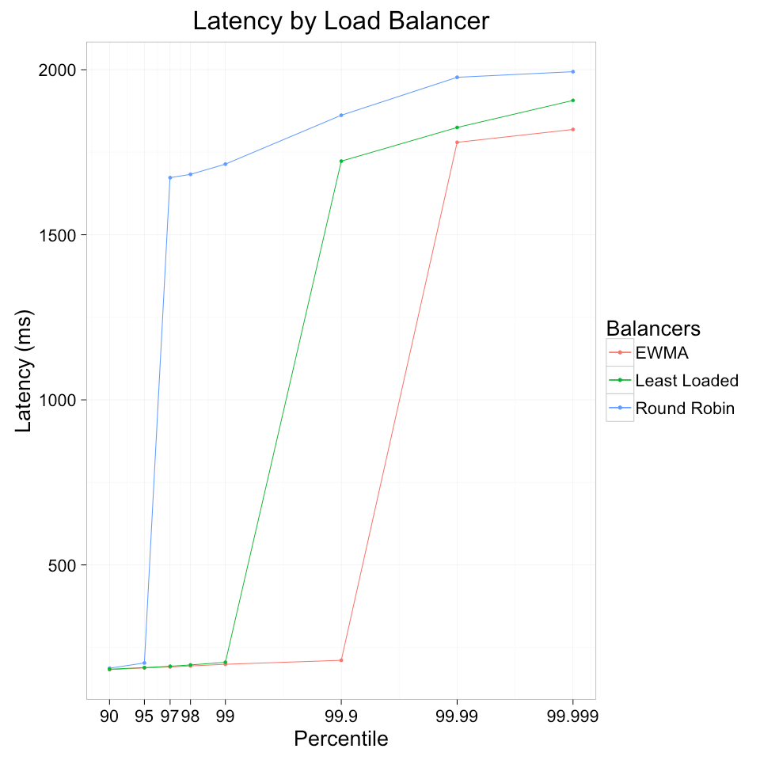

#### Эффективный *_PeakEWMA_* [[5](#sources)]

Принцип действия: рассчитываем скользящее среднее
времени длительности запросов и,
исходя из этого, выбираем бэкенд, на
который вышлем нагрузку.
Данный алгоритм использует концепцию экспоненциально взвешенных скользящих средних для определения «пиковой» нагрузки серверов.
Присваивая веса недавним измерениям трафика, он точно фиксирует текущую нагрузку сервера и динамически корректирует свой выбор для входящих запросов.

На графике предствален эксперимент с тремя алгоритмами: round robin, least loaded, and peak exponentially-weighted moving average (“peakEWMA”) [[5](#sources)]

В Ozon пошли дальше и вместо сайдкар контейнеров написали свою кастомную реализацию data panel поверх "гошного" gRPS, сохранив для разработчиков семантику библиотечных вызовов. Назвали свой Service Mesh — Warder. Этим они избавились от затраты ресурсов на сайдкар контейнеры. Протестировав все алгоритмы балансировки в своей инфраструктуре, *PeakEWMA* показал наилучшии метрики при тестах, он обеспечивает лучшую связь между RPS и RT (Response Time).
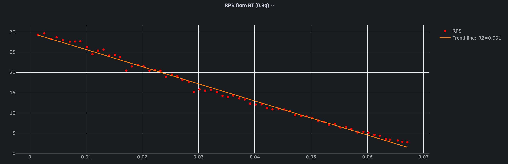


---

**<h2 id="5">5. Логическая схема БД</h2>**

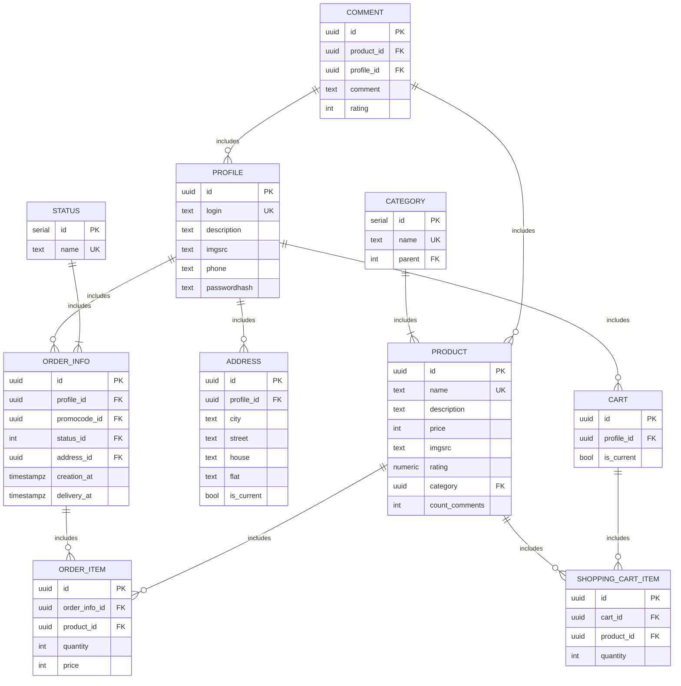

 

| Type          | Byte size |
| ------------- | --------- |
| SERIAL        | 4         |
| UUID          | 16        |
| INT           | 4         |
| NUMERIC(3, 2) | 8         |
| timestampz    | 8         |
| boolean       | 1         |


**PROFILE**
```TeX
  id(16) + login(32) + description(128) + imgsrc(64) + phone(19) + passwordHash(64) = 323
``` 
---
**PRODUCT**
```TeX
  id(16) + name(128) + description(1024) + price(4) + imgsrc(64) + rating(8) + category(16) + count_comments(4) = 1264
``` 
---
**COMMENT**
```TeX
  id(16) + product_id(16) + profile_id(16) + comment(256) + rating(4) = 308
  id(16) + product_id(16) + profile_id(16) + comment(0) + rating(4) = 52
``` 
---
**ORDER_INFO**
```TeX
  id(16) + profile_id(16) + promocode_id(16) + status_id(4) + address_id(16) + creation_at(8) + delivery_at(8) = 84
``` 
---
**STATUS**
```TeX
  id(4) + name(8) = 12
``` 
---
**ORDER_ITEM**
```TeX
  id(16) + order_info_id(16) + product_id(16) + quantity(4) + price(4) = 56
``` 
---
**ADDRESS**
```TeX
  id(16) + profile_id(16) + city(16) + street(16) + house(8) + flat(8) + is_current(1) = 81
``` 
---
**CATEGORY**
```TeX
  id(4) + name(16) + parent(4) = 24
``` 
---
**CART**
```TeX
  id(16) + profile_id(16) + is_current(1) = 33
``` 
---
**SHOPPING_CART_ITEM**
```TeX
  id(16) + cart_id(16) + product_id(16) + quantity(4) = 52
``` 
---

| Table                  | Row size [byte] | Number of row             | Total |
| ---------------------- | --------------- | ------------------------- | ----- |
| **PROFILE**            | 323             | $`30\cdot 10^6`$          |       |
| **PRODUCT**            | 1264            | $`82\cdot 10^6`$          |       |
| **COMMENT**            | 308; 52         | $`128.5\cdot 10^6; 53.5`$ |       |
| **ORDER_INFO**         | 84              |                           |       |
| **STATUS**             | 12              |                           |       |
| **ORDER_ITEM**         | 56              |                           |       |
| **ADDRESS**            | 81              |                           |       |
| **CATEGORY**           | 24              |                           |       |
| **CART**               | 33              |                           |       |
| **SHOPPING_CART_ITEM** | 52              |                           |       |


---


<h2 id="6">6. Физическая схема БД</h2>

Используем СУБД PostgreSQL и патерн Database Per Service.
#### Преимущества PostgreSQL:
* Поддержка БД неограниченного размера
* Мощные и надёжные механизмы транзакций и репликации
* Легко масштабировать 

### Потоковая репликация

#### Плюсы
* Работает из коробки.
* Годами обкатанная технология.
* Низкое потребление ресурсов, так как никакой логики
 при репликации нет, изменения выполняются в том же
порядке, что и на мастере.
* Простота конфигурации, настроил и забыл, простое
побайтовое копирование через WAL.

#### Минусы
* Реплицируется весь кластер целиком.
* Реплицируются все операции, включая ошибки.
* Изменения применяются в один поток.
* Работа только в рамках одной мажорной версии.
* Слейвы только read only.

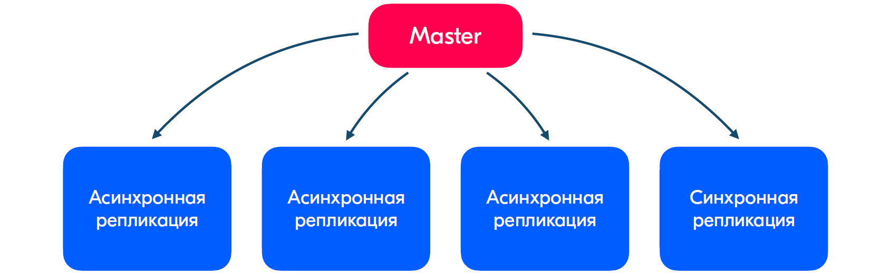

Структура кластера:
Один мастер, одна синхронная реплика и несколько асинхронных.

Патерн работы с данными.
Пишем в мастер.
Если супер актуальные данные и нужно минимизировать отставания, то читаем с синхронной реплики. В ином случае с асинхронных.
Избегаем обильного чтения с мастера и по возможности с синхронной реплики.
Базовое правило — в мастер пишем, читаем только из слейвов. Сихроная реплика выполняет функцию фейловера, она всегда находиться в другом ДЦ.

### Партиционирование

#### Решаемые проблемы:
Если много удаляем/апдейтим записи в базе, то vacuum может работать довольно долго.
Операции insert/update перестраивают индексы, идет перебалансировка деревьев.

Засчёт партиционирования кол-во индексов будет намного меньше, vacuum работает быстро на маленьких таблицах, следовательно все проблемы больших таблиц будут в N раз меньше.

Кол-во партиций делаем не более 100-200.

### Шардинг

Шардинг и решардинг сложная процедура, и использование готовых инструментов для шардинга в случае непредвиденных ситуаций приводит к разбирательству с чёрным ящиком. Сделаем свой инструмент.

#### Получение физического адреса данных и решардинг.
Shard Key, к примеру, user_id. Берём остаток от деления по модулю на 1024 от user_id и в зависимости от интервала куда попадает резуьтат 0..127, 128..255, 256..383 и т.д. выбираем физисеский адрес. Следовательно решардинг делаем в рамках одного кластера и для этого делим предыдущие интервалы попалам, получаем: 0..63, 64..127, 128..191 и т.д.

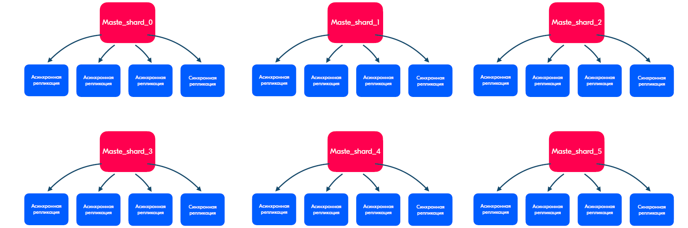

В итоге, из опыта Ozon, для таблицы _CART_ чтобы держать 20K RPS можно сделать 32 шарда: 1 синхронная реплика и 2 асинхронных реплики, 100 партиций: cart_0, cart_1, cart_2...

#### Асинхронное межсервисное взаимодействие. Сбор измененных данных с паттерном Outbox на Apache Kafka. 

Этот паттерн решает проблему потери событий.
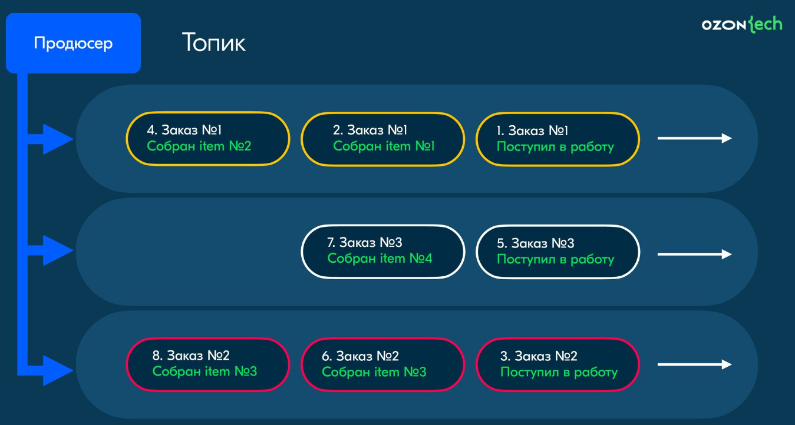
__Коньюмер-группа: Cервис отслеживания заказа__

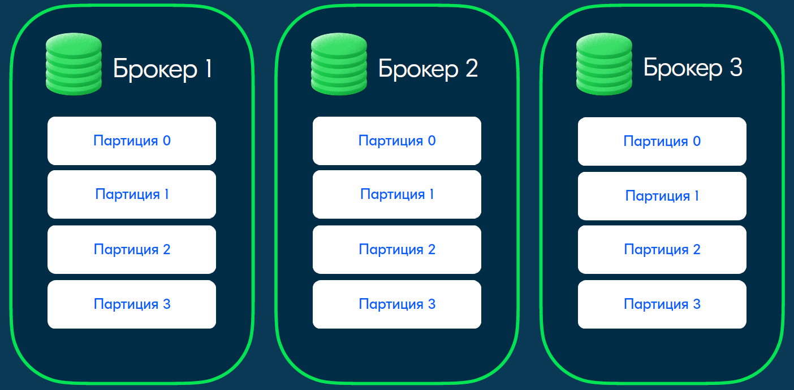
__Внутреннее устройство__

Используем Батчинг + сжатие

#### Сетевая файловая система (CEPH)

---

<h2 id="7">7. Алгоритмы</h2>
ElasticSearch нет встроенного индексатора. Одна из основных проблем — доставка обновлений до поискового индекса. Цены, скидки, наличие товаров на складах и отзывы часто обновляются, отчего генерируется большой поток изменённых записей. Обновления индекса в Elasticsearch делает Worker.

---

<h2 id="8">8. Технологии</h2>

| Технология    | Область применения                         | Обоснование                                                                                                                                                                                                                                                                   |
| ------------- | ------------------------------------------ | ----------------------------------------------------------------------------------------------------------------------------------------------------------------------------------------------------------------------------------------------------------------------------- |
| Typescript    | Frontend                                   | Статическая типизация в сравнении с JS, быстрое выявление ошибок, удобная отладка, модульность                                                                                                                                                                                |
| React         | Frontend                                   | Гибкий и популярный фреймворк, в основе которого компонентный подход, одно из наиболее распространенных решений                                                                                                                                                               |
| Golang        | Backend                                    | Минимализм, высокая производительность, относительно простая и эффективная конкурентная модель, богатая стандартная библиотека, активное сообщество                                                                                                                           |
| Prometheus    | Collection  of metrics                     | Масштабируемость, высокая доступность, гибкий язык запросов, активное сообщество                                                                                                                                                                                              |
| Grafana       | Visualization of metrics, monitoring       | Обширный функционал, интеграция со множеством источников метрик, алерты                                                                                                                                                                                                       |
| Docker        | Container runtime                          | Стандартное решение, среда выполнения контейнеров по умолчанию в k8s                                                                                                                                                                                                          |
| Kubernetes    | Container Deployment and Orchestration     | Распределение экземпляров по узлам и Availability Zones; Перезапуск/перераспределение экземпляров по узлам при падении экземпляров, узлов, датацентров; Масштабирование через auto-scaling; Service discovery, Балансировка внешнего и внутреннего трафика; Сетевая связность |
| PowerDNS      | L7 Loadbalancer                            | Ориентирован под микросервисную архитектуру, быстро развивается, молодой и уже не уступает в функционале самому простому - traefik.                                                                                                                                           |
| Redis         | Session Storage, Caching                   | Легко масштабируется, большое комьюнити, очень быстрый, проще в обслуживании, чем аналоги.                                                                                                                                                                                    |
| PostgreSQL    | Main Database                              | Надежность, большой функционал, большая экспертиза.                                                                                                                                                                                                                           |
| ElasticSearch | Search Engien                              | Выдает стабильную и одну из самых высоких производительностей как для индексирования, так и для всех типов запросов.                                                                                                                                                          |
| Apache Kafka  | Message Broker for Even-Driven asynch arch | Наиболее подходящее решение для указанных задач, держит более высокие нагрузки в сравнении с RabbitMQ, IMB MQ  и другими схожими технологиями, при этом преимущества аналогов в виде более гибкой настройки маршрутизации и т.п. не столь существенны для данного проекта     |
| Linkerd       | Service mesh                               |                                                                                                                                                                                                                                                                               |
| Vault         | Хранилище секретов                         |                                                                                                                                                                                                                                                                               |
| InfluxDB      | Logs aggregator                            |                                                                                                                                                                                                                                                                               |
| Clickhouse    | OLAP                                       |                                                                                                                                                                                                                                                                               |
| Neo4j         | Graph Database                             |                                                                                                                                                                                                                                                                               |


---


<h2 id="9">9. Схема проекта</h2>

[Схема проекта на icepanel](https://s.icepanel.io/4CQ6UE87YvPjL5/WNMj)


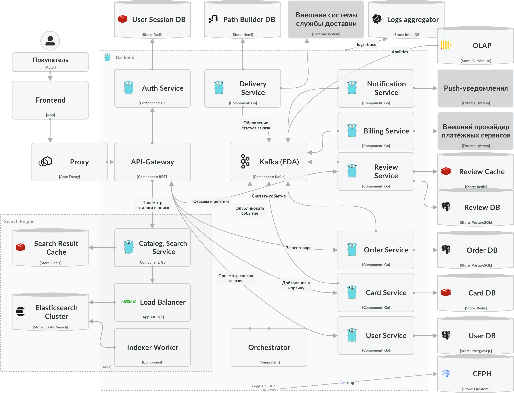

---

<h2 id="10">10. Обеспечение надёжности</h2>

***Service mesh*** — предоставляет проверки работоспособности, повторные запросы (retries), rate-limiting, таймауты(timeouts), функции восстановления после сбоев и размыкание цепи (curcuit breaking), поддерживает mTLS между сервисами, чтобы повысить безопасность взаимодействия на этом уровне, реализует списки контроля доступа (ACL) в качестве политик безопасности, поддерживает распределённую трассировку для отладки и расширенного мониторинга, позволяет узучать взаимодействие между сервисами.

***API Gateway***  — регулирует входящий и исходящий трафик, ставит глобальный и локальные Rate Limit,  устанавливает политику ретраев, осуществляет трассировка запросов. Однако является потециальной единой точкой отказа всех клиентских запросов, в связи с чем нужно применить качественное резервирование для данного компонента, например, в случае отказа перенаправлять пользователей в соседний **ЦОД** или иметь локальный резерв.

 В проекте применяется комплексный подход, API Gateway и Service Mesh с единой Control Panel, что обеспечит всестороннюю видимость.

***Отказоустойчивость на уровне DNS*** — в случае проблем на одной из DNS LoadBalancer **BGP**-анонс его **Virtual IP** прекращается, таблицы маршрутизации перестраиваются, клиенты идут на оставшиеся балансировщики. В случае недоступности real-DNS сервера, запросы идут в соседний **ЦОД**. Поддержка [eBPF](https://en.wikipedia.org/wiki/EBPF) на DNS серверах.

***Отказоустойчивое взаимодействие с внешними сервисами*** — сохранять последние полученные данные от внешних сервисов и использовать их в случает отказа. Изучить документацию внешних сервисов и выставить для них соответсвующий Rate Limit.

#### Отказоустойчивая архитектура

* Применение Gracefull shutdown на всех микросервисах.
*  В случает повышения RT ограничение скорости запросов от клиентов по IP адресам для предотвращения перегрузок. (Failover policy)
* Повторная попытка выполнения запросов (Retry) только на уровне API Gateway в целях избежания ловинообразного эффекта.
* Проектирование с учётом сохранения работоспособности системы в user-friendly режиме при негативных сценариях (Graceful degradation). 
* Резервирование ресурсов CPU и RAM, физических компонентов. Репликация баз данных.
* Плановые тренировки - отключение одного ЦОДа. В этом слачае нагрузка на соседних увеличиться не более чем по 10k RPS в пике. Расположение ЦОДов независимо, что соответсвует действительности, [см. главу 3](#3).

#### Применённые асинхронные паттерны
* Использование Event-driven архитектуры. Поддержка консистентности данных в различных
БД без использования распределенных
транзакций.
* Kafka реализует шаблон Saga (оркестрационный стиль) - помогает обеспечить согласованность в распределенных приложениях и координирует транзакции между несколькими микросервисами.
* Сбор измененных данных с паттерном Outbox, данный паттерн решает проблему потери событий.

#### Observalvability
* Агрегация логов с трассировкой. Применение паттерна request id.
* Профилирование. Регулярный запуск профилировщика для выявления узких мест производительности.
* Общирный мониторинг: Real user monitoring,
Synthetic monitoring,
External monitoring,
Сбор метрик, хорошо настроенные алерты.

---

<h2 id="11">11. Список серверов</h2>

### Базовый расчёт аппаратных ресурсов


#### Целевая пиковая нагрузка cервиса и значение ресурсов:
| Service         | RPS      | CPU  | RAM    | Net          |
| --------------- | -------- | ---- | ------ | ------------ |
| Catalog, Search | 30k RPS  | 3000 | 30 Gb  | 70 Gbit/s    |
| Product         | 5250 RPS | 525  | 5.2 GB | 24.6 Gbits/s |
| Card            | 105 RPS  | 10   | 105 Kb | 0.017 Gbit/s |
| Review          | 20 RPS   | 2    | 2 Kb   |              |
| Notification    | 60 RPS   | 6    | 6 Kb   |              |
| Order           | 35 RPS   | 4    | 4 Kb   |              |
| Delivery        | 160 RPS  | 16   | 16 Kb  |              |
| User            | 115 RPS  | 12   | 12 Kb  |              |

### DC-1

### DC-2

### DC-3

### DC-4


### Модель развертывания
Запуск приложений в Kubernetes

### Модель хостинга

Запуска проекта начнём с аренды виртуальных машин у Alibaba Cloud. Далнейшее развитие будем вести в гибридной облачной среде, сочетая преимущества локальной инфраструктуры с масштабируемостью и гибкостью облака.

Alibaba Cloud имеет известное и признанное имя лидера отрасли в области облачных вычислений. Особенно продвинут на рынке КНР, половина **ЦОД** на ходиться на территории материкового Китая.

### Конфигурации серверов

---

<h2 id="sources">Источники</h2>

1. https://ozon.tech/
2. https://habr.com/ru/companies/ozontech/articles/667600/
3. https://www.youtube.com/watch?v=kIZ_4PNvkro
4. https://habr.com/ru/companies/ozontech/articles/749328/
5. https://linkerd.io/2016/03/16/beyond-round-robin-load-balancing-for-latency/
6. https://tenchat.ru/media/1400080-privet-bezuprechniy-balans-ili-kombinatsiya-peakewma-i-p2c-ot-twitter
7. https://super-video-tube.ru/video/7A7Cq9w0G9Y/ozon-tech-community-go-meetup/
8. https://speakerdeck.com/ozontech/dmitrii-loghovskii-kak-zastavit-vashu-bazu-dannykh-dierzhat-20k-rps-varianty-masshtabirovaniia-i-ikh-minusy
9. https://bigdataschool.ru/blog/transactional-outbox-pattern-on-neo4j-and-kafka.html
10. https://speakerdeck.com/ozontech/viktor-korieisha-camyie-rasprostraniennyie-oshibki-pri-rabotie-s-apache-kafka
11. https://seller-edu.ozon.ru/how-to-start/onboarding/step-4-choose-work-mode 
12. https://speakerdeck.com/ozontech/boris-kuzovatkin-put-posylki-kliuchievyie-tiekhnologhii-i-proiekty-v-loghistikie
13. https://speakerdeck.com/ozontech/van-khachatrian-osobiennosti-stiek-i-protsiessy-komandy-poisk-riekomiendatsii-rieklama
14. https://baymard.com/blog/ecommerce-checkout-usability-report-and-benchmark
15. https://baymard.com/lists/cart-abandonment-rate
16. https://vc.ru/marketing/684029-ecommerce-metriki-dlya-novichkov-chto-zameryat-v-internet-magazine
17. https://corp.ozon.ru/tpost/ykmxt937i1-ozon-obyavlyaet-rezultati-za-chetvertii
18. https://www.yaguara.co/average-e-commerce-conversion-rate/
19. https://corp.ozon.ru/tpost/nlexf0jrb1-ozon-predostavlyaet-obnovlennuyu-informa
20. https://russianblogs.com/article/24031270152/
21. https://ir.ozon.com/ru/
22. https://e-pepper.ru/news/kak-riteylery-motiviruyut-klientov-ostavlyat-otzyvy.html
23. https://docs.ozon.ru/common-mobile/order/status/?country=RU
24. https://seller-edu.ozon.ru/work-with-goods/trebovaniya-k-kartochkam-tovarov/media/foto-i-video-tovara
25. https://top100.datainsight.ru/
26. https://sia.ru/?section=484&action=show_news&id=458179
27. https://journal.tinkoff.ru/news/review-ozon-3q2023/
28. https://vc.ru/marketing/603057-tendencii-v-otzyvah-klientov-2023
29. [Опрос Market Papa](https://traff.ink/marketpleysy/povedenie-pokypatlei-na-marketplacah/)
30. https://speakerdeck.com/ozontech/dienis-dubovitskii-kak-razdavat-bolshiie-faily-biez-butylochnykh-ghorlyshiek?slide=5
31. https://luminocity3d.org/WorldCity/
32. https://media.chinatelecomeurope.com/view/1056582712/
33. https://www.goclickchina.com/blog/
34. https://www.goclickchina.com/blog/how-dns-anycast-works-behind-the-great-firewall-of-china/
35. https://ipms.chinatelecomglobal.com/public/lookglass/lookglassDisclaimer.html
36. https://ruchina.org/economy/census2020.html
37. https://www.cisco.com/c/en/us/td/docs/ios-xml/ios/mp_l3_vpns/configuration/xe-3s/asr903/16-12-1/b-mpls-l3-vpns-xe-16-12-asr900/b-mpls-l3-vpns-xe-16-11-asr900_chapter_0101.pdf
38. https://nag.ru/material/36217
39. https://dnsdist.org/index.html
40. https://istio.io/latest/docs/ops/deployment/architecture/
41. https://linkerd.io/2.15/reference/architecture/
42. https://www.cncf.io/blog/2023/03/15/linkerd-and-ingress-controllers-bringing-the-outside-world-in/