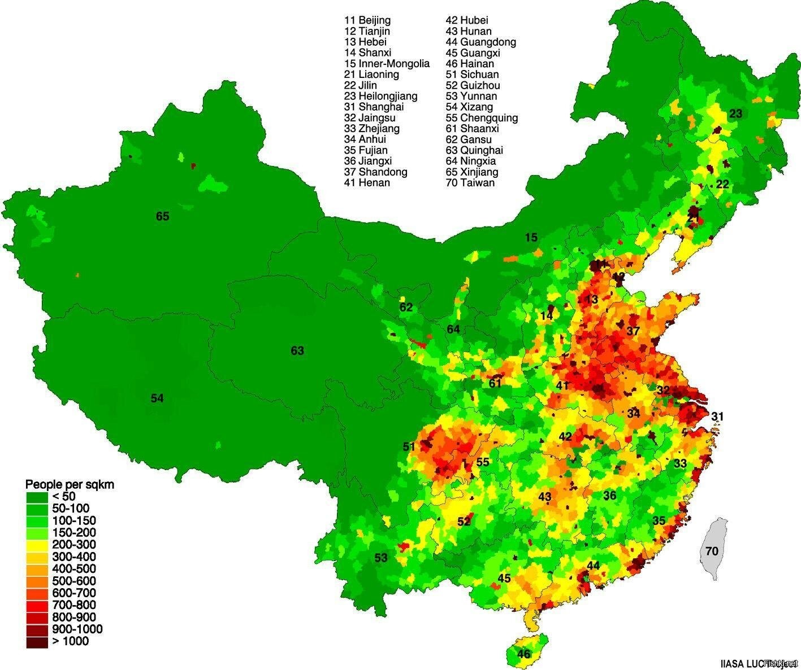
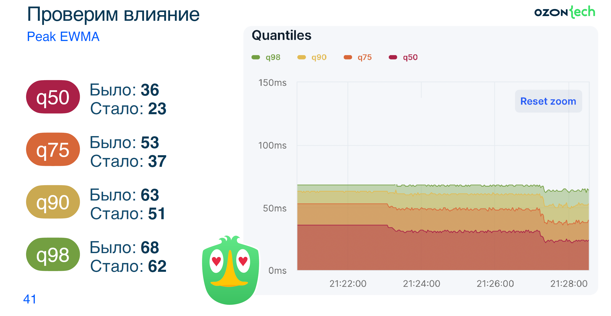
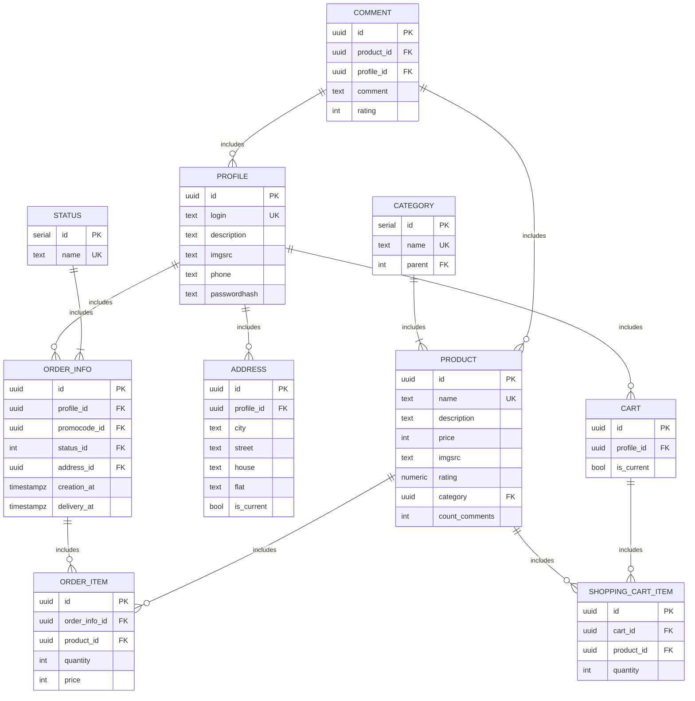

                                      Highload Ozon

---

## Содержание

* ### [1. Тема, целевая аудитория](#1)

* ### [2. Расчет нагрузки](#2)

* ### [3. Глобальная балансировка нагрузки](#3)
  
* ### [4. Локальная балансировка нагрузки](#4)
  
* ### [5. Логическая схема БД](#5)

* ### [6. Физическая схема БД](#6)
  
* * ### [Источники](#sources)
  
---

## 1. Тема, аудитория, функционал

### Тема

Ozon — выход крупнейшего E-commerce России на рынок КНР.  
### Целевая аудитория  \[[1]( https://ozon.tech/)]
- Рынок КНР.
- Возрастная категория: 18-45 лет; 40% женщин, 60% мужчин.
- Уникальных пользователей:
	-  в месяц 70 млн. (MAU)
	-  в день 15 млн. (DAU)
- 500к заказов в сутки; 50к заказов в минуту в дни распродаж.
- Изменение статуса заказа до 5 раз в день.

### MVP
Функционал:
- Авторизация и личный кабинет (список заказов и их статусы).
- Каталог, страница товара.
- Корзина (просмотр, изменение), оформления заказа.
- Отзывы и рейтинг.
- Cервис отслеживания заказа:
	- Рассылка Push-уведомлений со статусом заказа.
	- Обновление данных о статусе от транспортных компаний.
---

## 2. Расчет нагрузки 
### Сценарий посещения сайта одним пользователем в течение дня

| Действие | Кол-во | В среднем |
| ---- | ---- | ---- |
| Авторизация | [0, 1]  | 0.5 |
| Просмотр отдельного товара, каталога | [5, 55] | 30 |
| Добавление в корзину | [1, 5] | 3 |
| Отзыв и оценка | [0, 1] | 0.5 |
| Заказ товара | [0, 1] | 0.5 |
| Просмотр списка заказов | [1, 3] | 2 |

Средние количество действий за визит 37.
 
`37*DAU = 555 млн.` 
`555млн/(24*60*60) = 6500 RPS` - от пользователей

500к создаются в течение дня. Пусть в среднем жизненый цикл заказа 5 дней и его статус обновляется раз в сутки. Тогда действуюших заказов в среднем 2500к. 
`2500 RPS` - от логистики

### Объем изображений товаров
Ассортимент Ozon составил 250 млн товаров. Каждый товар содержит в среднем 4 фотографии, при этом каждое изображение весит в среднем 50 КБ. Отсюда получаем `50 * 4 * 250млн = 46,57 TБ`.

### Объем изображений в отзывах

Пусть 15% товаров имеют порядка 100 отзывов. И 1% отзывов из списка имеют [2, 7] фотографий. Тогда `250млн*0.15*(100*0.01*5) = 187.5млн` - изображений приходится на долю отзывов. Объём `187.5млн * 50 КБ = 8,73 ТБ`

---

## 3. Глобальная балансировка нагрузки 

Плотность населения КНР

---

## 4. Локальная балансировка нагрузки 

Возможные решения:
* *Weight round robin*
* *Consistent Hash*
* *Least Connected*
* *PeakEWMA*
#### Выберем *_PeakEWMA_*
Рассчитываем скользящее среднее
времени длительности запросов и,
исходя из этого, выбираем бэкенд, на
который вышлем нагрузку.
Данный алгоритм использует концепцию экспоненциально взвешенных скользящих средних для определения «пиковой» нагрузки серверов.
Присваивая веса недавним измерениям трафика, он точно фиксирует текущую нагрузку сервера и динамически корректирует свой выбор для входящих запросов.

Эксперимент с тремя алгоритмами: round robin, least loaded, and peak exponentially-weighted moving average (“peak EWMA”)

*PeakEWMA* показал наибольшее лучшии метрики при тестах в Ozon.

---

## 5. Логическая схема БД 

 

| Type          | Byte size |
| ------------- | --------- |
| SERIAL        | 4         |
| UUID          | 16        |
| INT           | 4         |
| NUMERIC(3, 2) | 8         |
| timestampz    | 8         |
| boolean       | 1         |

| Table              | Row size [byte]                   | Number of row | Total |
| ------------------ | --------------------------------- | ------------- | ----- |
| PROFILE            | 16 + 32 + 128 + 64 + 19 +64 = 323 |               |       |
| PRODUCT            |                                   |               |       |
| COMMENT            |                                   |               |       |
| ORDER_INFO         |                                   |               |       |
| STATUS             |                                   |               |       |
| ORDER_ITEM         |                                   |               |       |
| ADDRESS            |                                   |               |       |
| CATEGORY           |                                   |               |       |
| CART               |                                   |               |       |
| SHOPPING_CART_ITEM |                                   |               |       |

---

## 6. Логическая схема БД 

### Потоковая (физическая) репликация

#### Плюсы
* Работает из коробки.
* Годами обкатанная технология.
* Низкое потребление ресурсов, так как никакой логики
 при репликации нет, изменения выполняются в том же
порядке, что и на мастере.
* Простота конфигурации, настроил и забыл, простое
побайтовое копирование через WAL.

#### Минусы
* Реплицируется весь кластер целиком.
* Реплицируются все операции, включая ошибки.
* Изменения применяются в один поток.
* Работа только в рамках одной мажорной версии.
* Слейвы только read only.

Структура кластера:
Один мастер, одна синхронная релпика и несколько асинхронных.

Патерн работы с данными.
Пишем в мастер.
Если супер актуальные данные и нужно минимизировать отставания, то читаем с синхронной реплики. В ином случае с асинхронных.
Избеем обильного чтения с мастера и по возможности с синхронной реплики.
Базовое правило — в мастер пишем, читаем только из слейвов.

### Партиционирование

#### Решаемые проблемы:
Если много удаляем/апдейтим записи в базе, то vacuum может работать довольно долго.
Операции insert/update перестраивают индексы, идет перебалансировка деревьев.

Засчёт партиционирования кол-во индексов будет намного меньше, vacuum работает быстро на маленьких таблицах, следовательно все проблемы больших таблиц будут в N раз меньше.

Кол-во партиций делаем не более 100-200.

### Шардинг

Шардинг и решардинг сложная процедура, и использование готовых инструментов для шардинга в случае непридвиденных ситуаций приводит к разбирательству с чёрным ящиком. Сделаем свой инструмент.

#### Получение физического адреса данных и решардинг.
Shard Key, к примеру, user_id. Берём остаток от деления по модулю на 1024 от user_id и в зависимости от интервала куда попадает резуьтат 0..127, 128..255, 256..383 и т.д. выбираем физисеский адрес. Следоват решардинг делаем в рамках одного кластера и для этого делим предыдущие интервалы попалам, получаем: 0..63, 64..127, 128..191 и т.д.

---

## Источники 
* https://ozon.tech/
* https://habr.com/ru/companies/ozontech/articles/667600/
* https://www.youtube.com/watch?v=kIZ_4PNvkro
* https://habr.com/ru/companies/ozontech/articles/749328/
* https://linkerd.io/2016/03/16/beyond-round-robin-load-balancing-for-latency/
* https://tenchat.ru/media/1400080-privet-bezuprechniy-balans-ili-kombinatsiya-peakewma-i-p2c-ot-twitter
* https://super-video-tube.ru/video/7A7Cq9w0G9Y/ozon-tech-community-go-meetup/
* https://speakerdeck.com/ozontech/dmitrii-loghovskii-kak-zastavit-vashu-bazu-dannykh-dierzhat-20k-rps-varianty-masshtabirovaniia-i-ikh-minusy